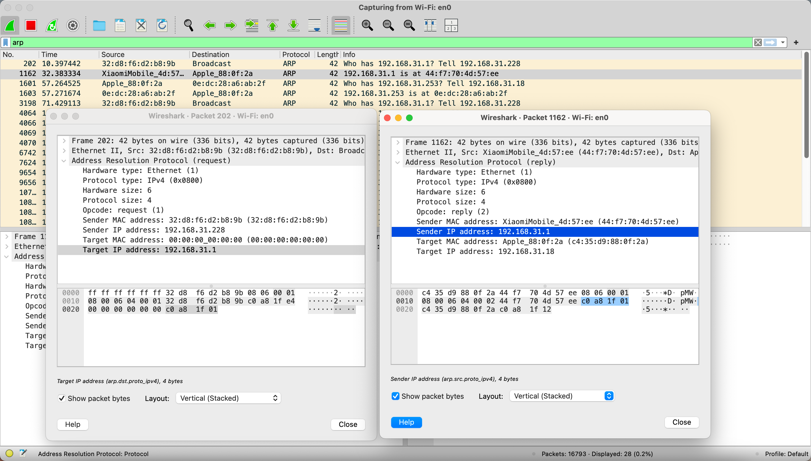

# Network Test Tool Report

**Name:** Chaoren Wang  
**Student ID:** 122090513  
**Date:** 2024-12-07

### 1. Testing Environment

- **Operating System:** MacOS 15.0
- **Network Interface:** Wi-Fi (en0)
- **Local IP Address:** 192.168.31.18
- **Router IP Address:** 192.168.31.1
- **DNS Server:** 8.8.8.8
- **Target IP Address:** 116.31.95.60
- **Target Domain:** cuhk.edu.cn
- **Tools:** `curl`, `ping`, `nslookup`, `arp`, `netstat`, `traceroute`. `wireshark` and `tshark` are also used for capturing and analyzing network packets.

### 2. Part A: Basic Network Test Commands [10 points]

#### 2.1 **`ifconfig`**
The `ifconfig` command is used to display or configure network interfaces. It shows the IP addresses and other information, including the MAC address, subnet mask, and interface status on the system.

No protocol is used in this command.

**Command:**
```bash
ifconfig
```

**Output:**
```
eth0: flags=4163<UP,BROADCAST,RUNNING,MULTICAST>  mtu 65535
        inet 172.17.0.2  netmask 255.255.0.0  broadcast 172.17.255.255
        ether 02:42:ac:11:00:02  txqueuelen 0  (Ethernet)
        RX packets 1009  bytes 22958828 (22.9 MB)
        RX errors 0  dropped 0  overruns 0  frame 0
        TX packets 589  bytes 43403 (43.4 KB)
        TX errors 0  dropped 0 overruns 0  carrier 0  collisions 0

lo: flags=73<UP,LOOPBACK,RUNNING>  mtu 65536
        inet 127.0.0.1  netmask 255.0.0.0
        inet6 ::1  prefixlen 128  scopeid 0x10<host>
        loop  txqueuelen 1000  (Local Loopback)
        RX packets 0  bytes 0 (0.0 B)
        RX errors 0  dropped 0  overruns 0  frame 0
        TX packets 0  bytes 0 (0.0 B)
        TX errors 0  dropped 0 overruns 0  carrier 0  collisions 0
```

#### 2.2 **`ping`**
The `ping` command is used to check connectivity to a remote host. It sends ICMP Echo Request packets to the target and measures the round-trip time for each packet.

**Protocol Used:** ICMP (Internet Control Message Protocol), which operates at the Network Layer (Layer 3) of the OSI model.

**Key Information in Output:**
- TTL (Time To Live): 63 - indicates how many more network hops the packet can traverse
- Round Trip Time: varies between 14.7-16.8 ms - shows network latency
- Packet Size: 56(84) bytes - 56 bytes of data plus 28 bytes of ICMP and IP headers

**Command:**
```bash
ping cuhk.edu.cn
```

**Output:**
```
PING cuhk.edu.cn (116.31.95.60) 56(84) bytes of data.
64 bytes from 116.31.95.60 (116.31.95.60): icmp_seq=1 ttl=63 time=16.1 ms
64 bytes from 116.31.95.60 (116.31.95.60): icmp_seq=2 ttl=63 time=15.3 ms
64 bytes from 116.31.95.60 (116.31.95.60): icmp_seq=3 ttl=63 time=16.8 ms
64 bytes from 116.31.95.60 (116.31.95.60): icmp_seq=4 ttl=63 time=14.7 ms

--- cuhk.edu.cn ping statistics ---
4 packets transmitted, 4 received, 0% packet loss, time 3008ms
rtt min/avg/max/mdev = 14.668/15.708/16.819/0.813 ms
```

#### 2.3 **`nslookup`**
The `nslookup` command is used to query DNS to obtain domain name or IP address mapping. 

**Protocol Details:**
- Primary Protocol: DNS over UDP (port 53)
- Alternative Protocols:
  - DNS over TCP: Used for responses larger than 512 bytes
  - DNS over TLS (DoT): Encrypted DNS queries over port 853
  - DNS over HTTPS (DoH): Encrypted DNS queries over HTTPS

**Output Explanation:**
- Server: The DNS server being queried (8.8.8.8 - Google's public DNS)
- Non-authoritative answer: Response comes from the server's cache rather than the authoritative server for the domain
- Address: The resolved IP address for the domain

**Command:**
```bash
nslookup cuhk.edu.cn 8.8.8.8
```

**Output:**
```
Server:         8.8.8.8
Address:        8.8.8.8#53

Non-authoritative answer:
Name:   cuhk.edu.cn
Address: 116.31.95.60
```

#### 2.4 **`arp`**
The `arp` command is used to display or modify the ARP table, which maps IP addresses to MAC addresses. It uses the ARP protocol, which is a link layer protocol.

**Command:**
```bash
arp -a
```

**Output:**
```
? (192.168.31.1) at 44:f7:70:4d:57:ee on en0 ifscope [ethernet]
? (192.168.31.18) at c4:35:d9:88:f:2a on en0 ifscope [ethernet]
? (192.168.31.83) at b2:7c:1e:8b:75:6e on en0 ifscope [ethernet]
? (192.168.31.99) at da:bd:44:a9:76:20 on en0 ifscope [ethernet]
? (192.168.31.253) at e:dc:28:a6:ab:2f on en0 ifscope [ethernet]
? (192.168.31.255) at ff:ff:ff:ff:ff:ff on en0 ifscope [ethernet]
mdns.mcast.net (224.0.0.251) at 1:0:5e:0:0:fb on en0 ifscope permanent [ethernet]
```

#### 2.5 **`netstat`**
The `netstat` command is used to display active network connections, listening ports, routing tables, and interface statistics.

**Command:**
```bash
netstat
```

**Output:**
```
Active Internet connections
Proto Recv-Q Send-Q  Local Address          Foreign Address        (state)
tcp4       0      0  localhost.56641        localhost.55787        ESTABLISHED
tcp4       0      0  localhost.55787        localhost.56641        ESTABLISHED
tcp4       0      0  localhost.56641        localhost.55786        ESTABLISHED
tcp4       0      0  localhost.55786        localhost.56641        ESTABLISHED
tcp4       0      0  localhost.56641        localhost.55785        ESTABLISHED
tcp4       0      0  localhost.55785        localhost.56641        ESTABLISHED
tcp6       0      0  fe80::3c1f:67ff:.8771  fe80::403:9bff:f.62163 ESTABLISHED
tcp4       0      0  192.168.31.33.55692    52.182.143.214.https   ESTABLISHED
tcp4       0      0  192.168.31.33.55691    183.1.15.218.bro.17010 ESTABLISHED
tcp4       0      0  localhost.7890         localhost.55686        ESTABLISHED
tcp4       0      0  localhost.55686        localhost.7890         ESTABLISHED
tcp4       0      0  192.168.31.33.55670    183.1.15.218.bro.17010 ESTABLISHED
...
```

#### 2.6 **`traceroute`**
The `traceroute` command is used to trace the path that packets take from the local system to a remote host, each hop along the path is represented by an IP address shown in the output, along with the time taken for each hop. It uses the ICMP protocol, which is a network layer protocol.

**Command:**
```bash
traceroute -P icmp www.cuhk.edu.cn
```

**Output:**
```
traceroute to www.cuhk.edu.cn (116.31.95.60), 64 hops max, 48 byte packets
 1  xiaoqiang (192.168.31.1)  6.236 ms  9.915 ms  23.824 ms
 2  192.168.1.1 (192.168.1.1)  6.380 ms  8.252 ms  13.637 ms
 3  10.141.64.1 (10.141.64.1)  16.561 ms  9.768 ms  10.083 ms
 4  120.80.167.213 (120.80.167.213)  9.829 ms  9.568 ms  9.978 ms
 5  * * *
 6  219.158.110.54 (219.158.110.54)  14.892 ms  17.729 ms  9.902 ms
 7  * * *
 8  * 202.97.95.133 (202.97.95.133)  18.309 ms *
 9  * 14.147.127.10 (14.147.127.10)  18.501 ms  12.918 ms
10  * * *
11  14.147.80.50 (14.147.80.50)  21.200 ms  24.399 ms  24.989 ms
12  116.31.95.60 (116.31.95.60)  19.429 ms  19.846 ms  20.017 ms
```


### 3. Part B: Capture TCP/UDP Packets and Connection Process [15 points]

#### 3.1 **TCP Connection Process**

First, we use `curl` to get the HTTP request from the server `cuhk.edu.cn`, i.e. `curl http://cuhk.edu.cn`.

**Wireshark Capture:**


**Steps:**
1. **SYN Packet** #112 – Client (192.168.31.18) sends a SYN packet to the server to initiate a connection.
2. **SYN-ACK Packet** #113 – Server (116.31.95.60) responds with a SYN-ACK packet as acknowledgement, confirming the connection request.
3. **ACK Packet** #114 – Client (192.168.31.18) sends an ACK packet back to the server to acknowledge the receipt of the SYN-ACK packet, completing the three-way handshake.

#### 3.2 **UDP Connection Process**

We use `nslookup` to query the DNS server `8.8.8.8` for the IP address of `cuhk.edu.cn`.

**Wireshark Capture:**


**Steps:**
1. **DNS Query** #275 – Client (192.168.31.18) sends a DNS query packet to the DNS server (8.8.8.8) to request the IP address of `cuhk.edu.cn`.
2. **DNS Response** #303 – DNS server (8.8.8.8) responds with a DNS response packet containing the IP address of `cuhk.edu.cn`.

### 4. Part C: Wireshark and Tshark Packet Capture Analysis [15 points]

#### 4.1 **Wireshark Capture**

**Command & Output (Tshark):**
```bash
tshark -i en0 -f "icmp or arp or udp"
```


```
Capturing on 'Wi-Fi: en0'
...
   16   9.415227 192.168.31.18 → 8.8.8.8      ICMP 98 Echo (ping) request  id=0xc286, seq=0/0, ttl=64 # This is the ping request
   17   9.711140      8.8.8.8 → 192.168.31.18 ICMP 98 Echo (ping) reply    id=0xc286, seq=0/0, ttl=53 (request in 16) # This is the ping response
...
   18  13.176259 192.168.31.18 → 104.194.8.134 UDP 75 64542 → 9993 Len=33 # This is the UDP packet
   19  13.176323 192.168.31.18 → 104.194.8.134 UDP 75 64542 → 9993 Len=33
   20  13.176326 192.168.31.18 → 104.194.8.134 UDP 75 64542 → 9993 Len=33
   21  13.176354 192.168.31.18 → 104.194.8.134 UDP 75 64542 → 9993 Len=33
...
   24  14.081061 192.168.31.18 → 8.8.8.8      DNS 71 Standard query 0x1be4 A cuhk.edu.cn # This is the DNS query
   25  14.560930      8.8.8.8 → 192.168.31.18 DNS 87 Standard query response 0x1be4 A cuhk.edu.cn A 116.31.95.60 # This is the DNS response
...
   59  28.197455 Apple_88:0f:2a → 72:0b:5d:07:84:ef ARP 42 Who has 192.168.31.33? Tell 192.168.31.18 # This is the ARP request
   60  28.202957 72:0b:5d:07:84:ef → Apple_88:0f:2a ARP 42 192.168.31.33 is at 72:0b:5d:07:84:ef # This is the ARP response
...
```

```bash
tshark -i en0 -f "tcp port 80"
```


```
Capturing on 'Wi-Fi: en0'
    1   0.000000 192.168.31.18 → 116.31.95.60 TCP 78 51842 → 80 [SYN] Seq=0 Win=65535 Len=0 MSS=1460 WS=64 TSval=2521737059 TSecr=0 SACK_PERM # This is the SYN
    2   0.021255 116.31.95.60 → 192.168.31.18 TCP 74 80 → 51842 [SYN, ACK] Seq=0 Ack=1 Win=65535 Len=0 MSS=1400 WS=1 SACK_PERM TSval=2685910185 TSecr=2521737059 # SYN-ACK
    3   0.021426 192.168.31.18 → 116.31.95.60 TCP 66 51842 → 80 [ACK] Seq=1 Ack=1 Win=131840 Len=0 TSval=2521737080 TSecr=2685910185 # ACK
    4   0.021459 192.168.31.18 → 116.31.95.60 HTTP 140 GET / HTTP/1.1 # Connection established, HTTP protocol now
    5   0.039600 116.31.95.60 → 192.168.31.18 TCP 66 80 → 51842 [ACK] Seq=1 Ack=75 Win=65461 Len=0 TSval=2685910203 TSecr=2521737080
    6   0.039601 116.31.95.60 → 192.168.31.18 TCP 176 HTTP/1.1 301 Moved Permanently # 301 Moved Permanently
    7   0.039651 192.168.31.18 → 116.31.95.60 TCP 66 51842 → 80 [ACK] Seq=75 Ack=111 Win=131712 Len=0 TSval=2521737098 TSecr=2685910203 # ACK
    8   0.059510 116.31.95.60 → 192.168.31.18 HTTP 66 HTTP/1.1 301 Moved Permanently # 301 Moved Permanently
    9   0.059599 192.168.31.18 → 116.31.95.60 TCP 66 51842 → 80 [ACK] Seq=75 Ack=112 Win=131712 Len=0 TSval=2521737119 TSecr=2685910221 # ACK
   10   0.062385 192.168.31.18 → 116.31.95.60 TCP 66 51842 → 80 [FIN, ACK] Seq=75 Ack=112 Win=131712 Len=0 TSval=2521737121 TSecr=2685910221 # FIN-ACK
   11   0.080326 116.31.95.60 → 192.168.31.18 TCP 66 80 → 51842 [ACK] Seq=112 Ack=76 Win=65535 Len=0 TSval=2685910244 TSecr=2521737121 # ACK
```


**Wireshark Screenshot:**



**Explanation:**
- **ARP**: Address Resolution Protocol used to map an IP address to a MAC address. We can see the ARP request and response packets in the capture.
  - Sender: 192.168.31.228 -> Receiver: 00:00:00:00:00:00, asking for the IP address of 192.168.31.1
  - Sender: 44:f7:70:4d:57:ee (router) -> Receiver: 192.168.31.18, responding with the IP address of 192.168.31.1
- **ICMP**: Internet Control Message Protocol, used for diagnostic messages like ping. We can see the ping request and response packets in the capture.
  - Sender: 192.168.31.18 -> Receiver: 116.31.95.60, sending a ping request to the DNS server, data length is 48 bytes
  - Sender: 116.31.95.60 -> Receiver: 192.168.31.18, responding to the ping request, data length is 48 bytes
- **UDP**: User Datagram Protocol, a connectionless protocol for sending datagrams. We can see the DNS query and response packets in the capture.
  - Sender: 192.168.31.18 -> Receiver: 8.8.8.8, sending a DNS query packet to the DNS server, data length is 71 bytes, asking for the IP address of `cuhk.edu.cn`
  - Sender: 8.8.8.8 -> Receiver: 192.168.31.18, responding to the DNS query, data length is 87 bytes, answering with the IP address of `cuhk.edu.cn` is 116.31.95.60
- **TCP**: Transmission Control Protocol, a connection-oriented protocol for reliable data transfer. We can see the TCP connection establishment, data transfer, and termination in the capture. 
  - Details are shown in the Part B
- **HTTP**: Hypertext Transfer Protocol, used for transferring web pages. We can see the HTTP request and response packets in the capture.
  - Client (192.168.31.18) send: `GET / HTTP/1.1`
  - Server (116.31.95.60) response: `HTTP/1.1 301 Moved Permanently`


**Question:** Why contents of the bag you caught may not be the same as what you learned?

This might because different versions of the same protocol have different default settings. As the test environment is MacOS, might be different from the Linux environment.


### 5. Part D: Encapsulation and Decapsulation Process [10 points]

The encapsulation process involves wrapping data with necessary protocol information at each layer of the OSI model, while decapsulation is the reverse process when receiving data.

**Encapsulation for Screenshot:**
1. **Application Layer**: Data (e.g., HTTP request to `cuhk.edu.cn`).
2. **Transport Layer**: Data is encapsulated in TCP segments (or UDP segments in the DNS query), with the source port (51034) and destination port (80).
3. **Network Layer**: Data is encapsulated in IP packets, including the source IP address (192.168.31.18) and destination IP address (116.31.95.60).
4. **Data Link Layer**: Data is encapsulated in Ethernet frames, including the source MAC address (c4:35:d9:88:0f:2a) and destination MAC address (44:f7:70:4d:57:ee).

**Wireshark Screenshot:**


**Decapsulation Process:**
When a packet is received, it goes through the reverse process—Ethernet frame is stripped, IP packet is extracted, and TCP/UDP segment is processed at the transport layer.
