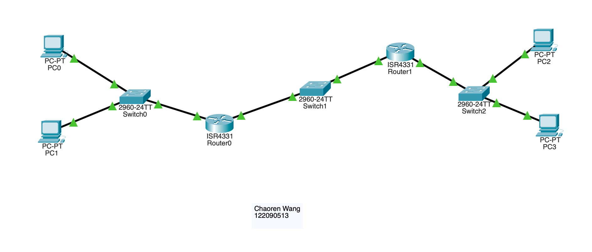
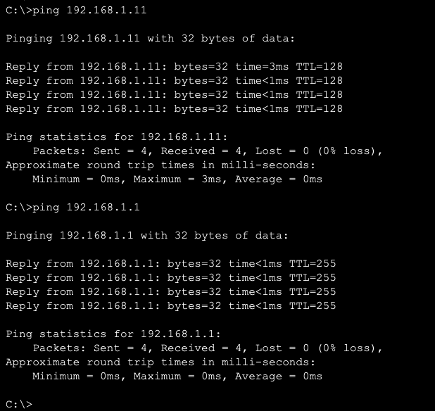
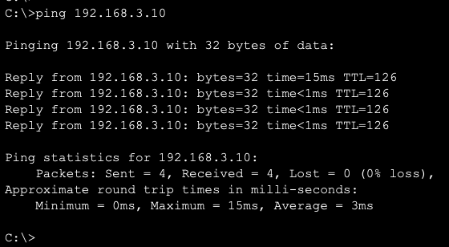
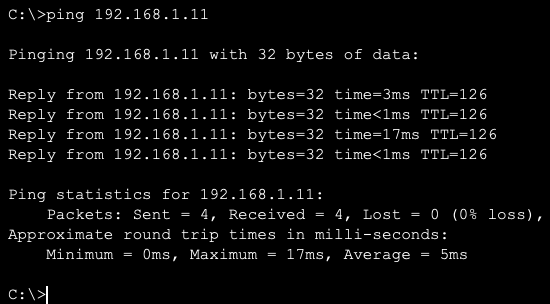
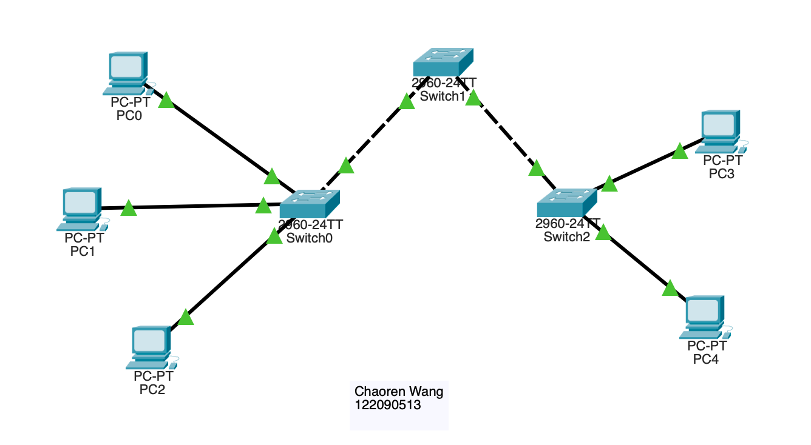
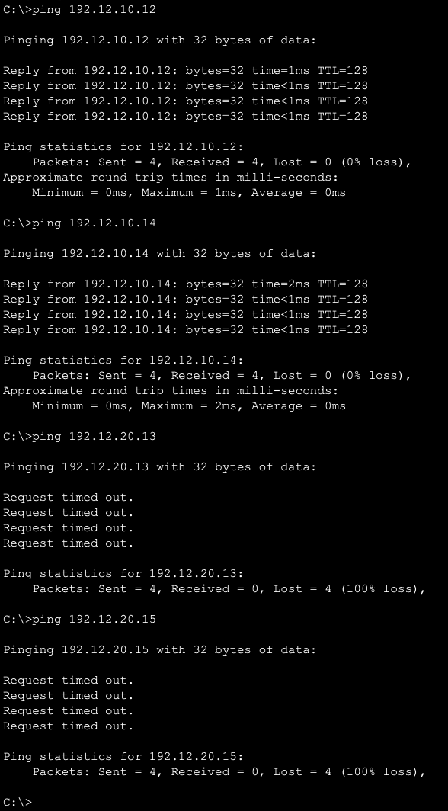
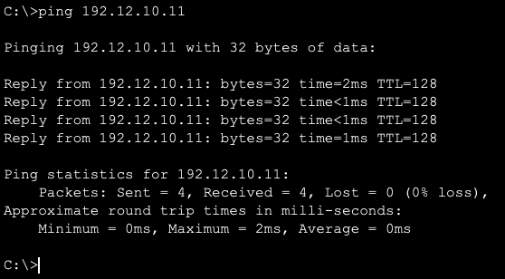

# Network Simulation Report

**Name:** Chaoren Wang  
**Student ID:** 122090513  
**Date:** 2024-12-07

---

## Task 1: Network Topology Design

### Description
The network topology consists of the following components:
- **Devices:** 2 Routers, 3 Switches, 4 PCs
- **Connections:**  
  - Switches connected to routers via Ethernet.  
  - PCs connected to switches.  
  - Routers interconnected via a core switch.

### Configuration

#### Router Configuration
- **Router Models:** ISR4331  
- **IP Address Configuration:**
  - **Router 0:**
    - Interface GigabitEthernet0/0: `192.168.1.1/24`
    - Interface GigabitEthernet0/1: `192.168.2.1/24`
    - Routing: Static routing `192.168.3.0/24` via `192.168.2.2`
  - **Router 1:**
    - Interface GigabitEthernet0/0: `192.168.2.2/24`
    - Interface GigabitEthernet0/1: `192.168.3.1/24`
    - Routing: Static routing `192.168.1.0/24` via `192.168.2.1`

#### Switch Configuration
- **Switch Models:** 2960-24TT  
- Configured standard connections between PCs and routers.

#### PC Configuration
- **IP Addresses:**
  - PC0: `192.168.1.10/24`
  - PC1: `192.168.1.11/24`
  - PC2: `192.168.3.10/24`
  - PC3: `192.168.3.11/24`
- Gateway configured to corresponding router interfaces.
  - PC0, PC1: Router 0, i.e., `192.168.1.1`
  - PC2, PC3: Router 1, i.e., `192.168.3.1`

### Network Connectivity Results

| # | Source Device | Destination Device | Ping Result | Test Type |
|---|---------------|--------------------|-------------|-----------|
| 1 | PC0           | PC1                | Success     | Subnet connectivity |
| 2 | PC0           | Router1            | Success     | Default gateway |
| 3 | PC1           | PC3                | Success     | Cross-subnet connectivity |
| 4 | PC3           | PC1                | Success     | Cross-subnet connectivity in reverse direction |

Screenshot for test 1 and 2:

Screenshot for test 3:

Screenshot for test 4:

All tests are successful, showing the network connectivity is working as expected.

### Conclusion and Challenges
#### Conclusion
The topology was successfully configured. All devices were able to communicate, confirming the validity of the setup.

#### Challenges
1. Before the gateway was configured, only first type of tests were successful. This problem was solved after the gateway was configured on every PC.
2. Only Router 0 was configured to route requests to the other subnet, causing the failure of ping test, after adding the routing configuration on Router 1, the problem was solved.

---

## Task 2: VLAN Configuration

### Description
This task focused on creating VLANs and assigning access ports for logical groupings.  
- **VLANs and Corresponding IP Addresses:**
  - VLAN 10: `192.12.10.0/24`  
  - VLAN 20: `192.12.20.0/24`

### Configuration Details

#### Switch Configuration
- **Switch Models:** 2960-24TT  
- **VLANs Created:**
  - VLAN 10 (Access): Assigned to PCs 0, 1, and 3.
  - VLAN 20 (Access): Assigned to PCs 2 and 4.
  - VLANs 10 and 20 (Trunk): Configured between three switches.

#### PC Configuration
- **IP Addresses:**
  - PC0: `192.12.10.11/24`, VLAN 10
  - PC1: `192.12.10.12/24`, VLAN 10
  - PC2: `192.12.20.13/24`, VLAN 20
  - PC3: `192.12.10.14/24`, VLAN 10
  - PC4: `192.12.20.15/24`, VLAN 20

### Connectivity Testing Results

| # | Source Device | Destination Device | Ping Result | Test Type |
|---|---------------|--------------------|-------------|-----------|
| 1 | PC0 (VLAN 10) | PC1 (VLAN 10)      | Success     | Same-VLAN |
| 2 | PC0 (VLAN 10) | PC3 (VLAN 10)      | Success     | Same-VLAN |
| 3 | PC0 (VLAN 10) | PC2 (VLAN 20)      | Fail        | Cross-VLAN |
| 4 | PC0 (VLAN 10) | PC4 (VLAN 20)      | Fail        | Cross-VLAN |
| 5 | PC3 (VLAN 10) | PC0 (VLAN 10)      | Success     | Same-VLAN in reverse direction |

Screenshot for test 1 - 4:

Screenshot for test 5:

### Conclusion and Challenges
#### Conclusion
The VLANs were configured successfully. Devices within the same VLAN communicated seamlessly, and inter-VLAN communication was blocked, as expected.

#### Challenges
1. Ethernet ports were not configured correctly, causing the failure of ping test.
2. VLANs 10 and 20 needed to be manually created, and trunk ports were required to connect switches.
